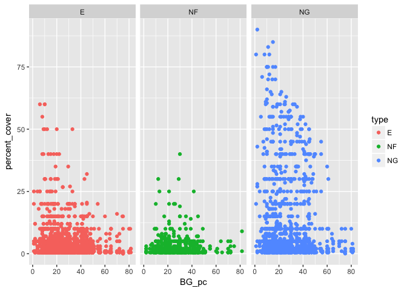
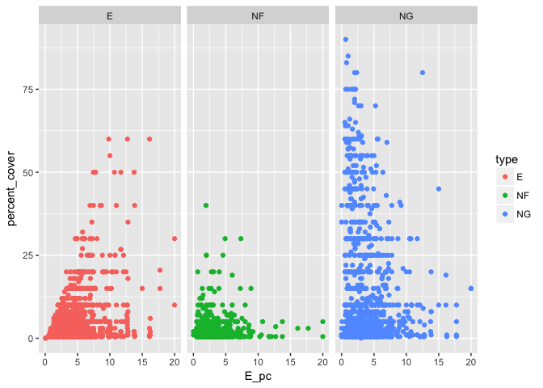
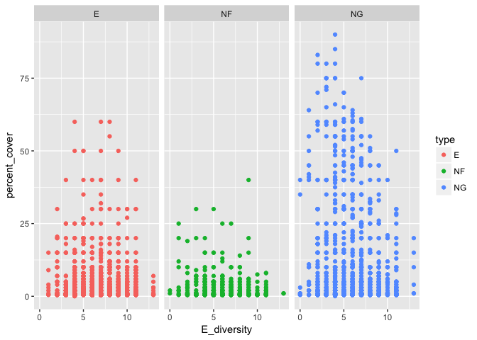
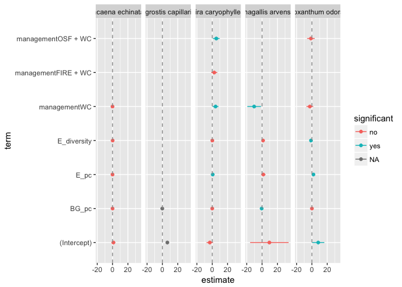

# Fitting many models with `purrr`, `broom`, `dplyr`

Let's start simple, highlighting some basic tools that we will need later: chiefly, tools from the broom package.

# A tidy workflow for working with one model


## What are tidy dataframes / tidy data?

Hadley (Wickham, 2014) puts this well: 

> "tidy datasets provide a standardised way to link the structure of a dataset (its physical layout) with its semantics (its meaning)"

Appearance layout of tidy data:

- Each variable is represented by a single column
- each observation has its own row
- each value has its own cell


More info: [https://github.com/egouldo/VicBioCon17_data_wrangling/blob/master/modules/06_tidy_data.md](https://github.com/egouldo/VicBioCon17_data_wrangling/blob/master/modules/06_tidy_data.md)

## What's in a model? Sweeping up with broom

Regressions are messy in R... 


```r
library(magrittr)
lm_car <- lm(mpg ~ wt + qsec, data = mtcars)
summary(lm_car) # messy output
```

```
## 
## Call:
## lm(formula = mpg ~ wt + qsec, data = mtcars)
## 
## Residuals:
##     Min      1Q  Median      3Q     Max 
## -4.3962 -2.1431 -0.2129  1.4915  5.7486 
## 
## Coefficients:
##             Estimate Std. Error t value Pr(>|t|)    
## (Intercept)  19.7462     5.2521   3.760 0.000765 ***
## wt           -5.0480     0.4840 -10.430 2.52e-11 ***
## qsec          0.9292     0.2650   3.506 0.001500 ** 
## ---
## Signif. codes:  0 '***' 0.001 '**' 0.01 '*' 0.05 '.' 0.1 ' ' 1
## 
## Residual standard error: 2.596 on 29 degrees of freedom
## Multiple R-squared:  0.8264,	Adjusted R-squared:  0.8144 
## F-statistic: 69.03 on 2 and 29 DF,  p-value: 9.395e-12
```

1. Extracting coefficients takes multiple steps `data.frame(coef(summary(lm_car)))`
2. Information is stored in rownames: combining models requires wrangling
3. Column names are annoying: must access with `$“Pr(>|t|)”`, and is converted to `Pr...t..`
4. Information computed in the print method is not stored, e.g. F-stat and p-values


```r
# Enter broom:
library(broom)
```

Broom generates tidy model summaries, turning statistical models into tidy data-frames.

- `broom::tidy` model component-level statistics: coefficient estimates, SE, etc.
- `broom::augment` observation-level, fitted values, residuals etc.
- `broom::glance` - model-level statistics: e.g. ${R}^{2}$ , AIC, deviance etc.


```r
lm_car %>% broom::tidy() # one observation per model term
```

```
##          term  estimate std.error  statistic      p.value
## 1 (Intercept) 19.746223 5.2520617   3.759709 7.650466e-04
## 2          wt -5.047982 0.4839974 -10.429771 2.518948e-11
## 3        qsec  0.929198 0.2650173   3.506179 1.499883e-03
```

```r
lm_car %>% broom::augment() # one observation per observation in the original data, new columns preceded with "."
```

```
##              .rownames  mpg    wt  qsec   .fitted   .se.fit      .resid
## 1            Mazda RX4 21.0 2.620 16.46 21.815109 0.6832424 -0.81510855
## 2        Mazda RX4 Wag 21.0 2.875 17.02 21.048224 0.5468271 -0.04822401
## 3           Datsun 710 22.8 2.320 18.61 25.327279 0.6397681 -2.52727880
## 4       Hornet 4 Drive 21.4 3.215 19.44 21.580569 0.6231436 -0.18056924
## 5    Hornet Sportabout 18.7 3.440 17.02 18.196114 0.5120709  0.50388581
## 6              Valiant 18.1 3.460 20.22 21.068588 0.8032106 -2.96858808
## 7           Duster 360 14.3 3.570 15.84 16.443423 0.7010125 -2.14342291
## 8            Merc 240D 24.4 3.190 20.00 22.227120 0.7302126  2.17288034
## 9             Merc 230 22.8 3.150 22.90 25.123713 1.4101406 -2.32371308
## 10            Merc 280 19.2 3.440 18.30 19.385488 0.4909773 -0.18548760
## 11           Merc 280C 17.8 3.440 18.90 19.943006 0.5571043 -2.14300639
## 12          Merc 450SE 16.4 4.070 17.40 15.368981 0.6147893  1.03101923
## 13          Merc 450SL 17.3 3.730 17.60 17.271134 0.5204289  0.02886576
## 14         Merc 450SLC 15.2 3.780 18.00 17.390414 0.5387353 -2.19041433
## 15  Cadillac Fleetwood 10.4 5.250 17.98  9.951297 1.0916727  0.44870314
## 16 Lincoln Continental 10.4 5.424 17.82  8.924276 1.1612916  1.47572368
## 17   Chrysler Imperial 14.7 5.345 17.42  8.951388 1.1149850  5.74861230
## 18            Fiat 128 32.4 2.200 19.47 26.732147 0.7508141  5.66785310
## 19         Honda Civic 30.4 1.615 18.52 28.802478 0.8918780  1.59752172
## 20      Toyota Corolla 33.9 1.835 19.90 28.974215 0.9091942  4.92578455
## 21       Toyota Corona 21.5 2.465 20.01 25.896199 0.7735519 -4.39619858
## 22    Dodge Challenger 15.5 3.520 16.87 17.652896 0.5348830 -2.15289593
## 23         AMC Javelin 15.2 3.435 17.30 18.481530 0.4873703 -3.28152953
## 24          Camaro Z28 13.3 3.840 15.41 14.680913 0.8069223 -1.38091265
## 25    Pontiac Firebird 19.2 3.845 17.05 16.179557 0.5703305  3.02044258
## 26           Fiat X1-9 27.3 1.935 18.90 27.540219 0.7829311 -0.24021927
## 27       Porsche 914-2 26.0 2.140 16.70 24.461147 0.7941163  1.53885259
## 28        Lotus Europa 30.4 1.513 16.90 27.812072 1.0132627  2.58792829
## 29      Ford Pantera L 15.8 3.170 14.50 17.217490 1.0029250 -1.41749041
## 30        Ferrari Dino 19.7 2.770 15.50 20.165881 0.8318811 -0.46588119
## 31       Maserati Bora 15.0 3.570 14.60 15.291217 0.9642049 -0.29121742
## 32          Volvo 142E 21.4 2.780 18.60 22.995915 0.5294628 -1.59591510
##          .hat   .sigma      .cooksd  .std.resid
## 1  0.06925986 2.637300 2.627038e-03 -0.32543724
## 2  0.04436414 2.642112 5.587076e-06 -0.01900129
## 3  0.06072636 2.595763 2.174253e-02 -1.00443793
## 4  0.05761138 2.641895 1.046036e-04 -0.07164647
## 5  0.03890382 2.640343 5.288512e-04  0.19797699
## 6  0.09571739 2.575422 5.101445e-02 -1.20244126
## 7  0.07290940 2.608421 1.927373e-02 -0.85745788
## 8  0.07910987 2.607247 2.178198e-02  0.87216352
## 9  0.29502367 2.589845 1.585198e-01 -1.06600994
## 10 0.03576473 2.641888 6.545298e-05 -0.07275945
## 11 0.04604739 2.609389 1.149236e-02 -0.84513499
## 12 0.05607697 2.634506 3.308687e-03  0.40875633
## 13 0.04018415 2.642123 1.797445e-06  0.01134893
## 14 0.04306089 2.608022 1.115778e-02 -0.86248219
## 15 0.17681412 2.640475 2.598066e-03  0.19049175
## 16 0.20008504 2.623664 3.367812e-02  0.63554917
## 17 0.18444635 2.352379 4.532124e-01  2.45190009
## 18 0.08363669 2.393496 1.582375e-01  2.28060859
## 19 0.11801654 2.622499 1.914813e-02  0.65521310
## 20 0.12264373 2.448094 1.911855e-01  2.02559882
## 21 0.08877914 2.494666 1.021948e-01 -1.77390963
## 22 0.04244725 2.609209 1.061160e-02 -0.84743754
## 23 0.03524115 2.565582 2.016397e-02 -1.28686488
## 24 0.09660408 2.627824 1.116304e-02 -0.55961992
## 25 0.04825977 2.576528 2.403811e-02  1.19255217
## 26 0.09094506 2.641700 3.140692e-04 -0.09704626
## 27 0.09356216 2.624412 1.333611e-02  0.62257836
## 28 0.15232675 2.588179 7.021574e-02  1.08268973
## 29 0.14923442 2.626118 2.048803e-02 -0.59194477
## 30 0.10267260 2.640493 1.368718e-03 -0.18943740
## 31 0.13793379 2.641464 7.784575e-04 -0.12081283
## 32 0.04159134 2.624106 5.703374e-03 -0.62791439
```

```r
lm_car %>% broom::glance() # one observation per model
```

```
##   r.squared adj.r.squared    sigma statistic      p.value df    logLik
## 1 0.8264161     0.8144448 2.596175  69.03311 9.394765e-12  3 -74.36025
##        AIC      BIC deviance df.residual
## 1 156.7205 162.5834 195.4636          29
```


Don't know what a pipe (`%>%`) is? Click here: [https://github.com/egouldo/VicBioCon17_data_wrangling/blob/master/modules/05_dplyr-walkthrough.md#writing-sentences-joining-verbs-with-pipes-](https://github.com/egouldo/VicBioCon17_data_wrangling/blob/master/modules/05_dplyr-walkthrough.md#writing-sentences-joining-verbs-with-pipes-)

## Why do we want tidy model summaries?

- The data manipulation and reshaping is done for you, by `broom`. You can focus on understanding your model and your data, rather than on writing code.
- Tidy data works with tidy tools: we can easily visualise broom's output with `ggplot`, e.g. plotting the model in dataspace, generate coefficient plots, survival curves, etc.
- Working with MANY models: tidy model outputs can be easily combined, and compared.

# When do we fit multiple models?

1. Exploring the space of all possible models and their relative merits: E.g. for a given model family, you can explore different forms, for example, for a linear model we could generate all models with main effects.
2. Varying model settings: e.g. systematically alter the tuning parameters to observe the result. 
3. Fitting the same model to different datasets: cross-validation, bootstrapping, simulating data, sensitivity analyses, etc.
4. Finding global optima - e.g. when model fitting might not converge to global optimum, you can have a collection of models generated from multiple random starts.
5. Fitting many simple models ot smaller sub-groups of your data rather than a single complex model to the whole dataset

## Computational challenges of fitting many models

We can distill the above tasks into two primary workflows:

1. When you have a single model that you want to repeatedly fit to different sub-sets of the larger data set.
2. When you have a selection of different models you want to fit to the same piece of data repeatedly.

You could solve this computationally by fitting many models using for-loops. Or, when fitting fewer models, you can store your models and their resultant outputs as objects in your global environment.

- Loops: slow, *cumbersome* to write
- Intermediate objects: clutter up your global environment, must keep mental-track of each object
- For either method, you still need to extract the desired model outputs from each fitted model, wrangle them, combine them, perhaps wrangle some more, before you can analyse and/or visualise your many models simultaneously.

But there are a suite of tools out there that get the job done more efficiently (both in terms of computational efficiency, and in terms of the actual code that you write)!

## A workflow for same model, many pieces:

What do we need? (getting around the loop / many objects conundrum)

1. dplyr: create new columns / variables, amend existing ones
2. tidyr: nested data with list-columns
3. purrr: map functions, map nested dataframes to the modeling function or to broom function


```r
library(dplyr) # data manipulation
```

```
## 
## Attaching package: 'dplyr'
```

```
## The following objects are masked from 'package:stats':
## 
##     filter, lag
```

```
## The following objects are masked from 'package:base':
## 
##     intersect, setdiff, setequal, union
```

```r
library(tidyr) # For reshaping dataframes, specifically nesting
```

```
## 
## Attaching package: 'tidyr'
```

```
## The following object is masked from 'package:magrittr':
## 
##     extract
```

```r
library(purrr) # For applying functions to nested dataframes
```

```
## 
## Attaching package: 'purrr'
```

```
## The following objects are masked from 'package:dplyr':
## 
##     contains, order_by
```

```
## The following object is masked from 'package:magrittr':
## 
##     set_names
```

```r
library(ggplot2) # good lookin' plots
spp_mods <- feather::read_feather("./data/grasslands_data")

spp_mods
```

```
## # A tibble: 3,874 × 24
##    transect_number quadrat         species percent_cover origin
##             <fctr>  <fctr>          <fctr>         <dbl>  <chr>
## 1                1       4 acaena echinata           1.0      N
## 2                1       9 acaena echinata           5.0      N
## 3                2       7 acaena echinata           2.0      N
## 4                2       9 acaena echinata           0.5      N
## 5                5       2 acaena echinata           0.5      N
## 6                5       4 acaena echinata           0.5      N
## 7                7       4 acaena echinata           1.0      N
## 8               11       3 acaena echinata           0.5      N
## 9               11       8 acaena echinata           2.0      N
## 10              12       4 acaena echinata           2.0      N
## # ... with 3,864 more rows, and 19 more variables: growth_form <chr>,
## #   type <fctr>, size <dbl>, date <date>, orientation <chr>,
## #   assistant <chr>, management <fctr>, burn_season <fctr>,
## #   years_since <dbl>, biomass_reduction_year <dbl>,
## #   management_unit <fctr>, BG_pc <dbl>, E_pc <dbl>, NF_pc <dbl>,
## #   NG_pc <dbl>, BG_diversity <dbl>, E_diversity <dbl>,
## #   NF_diversity <dbl>, NG_diversity <dbl>
```

```r
spp_mods %>%
        ggplot(aes(y = percent_cover, x = BG_pc, colour = type)) +
        geom_point() + facet_grid(~ type)
```

<!-- -->

```r
spp_mods %>%
        ggplot(aes(y = percent_cover, x = E_pc, colour = type)) +
        geom_point() + facet_grid(~ type)
```

<!-- -->

```r
spp_mods %>%ggplot(aes(y = percent_cover, x = E_diversity, colour = type)) +
        geom_point() + facet_grid(~ type)
```

<!-- -->

### nest the data: list-columns


```r
spp_mods <-
        spp_mods %>%
        group_by(species, type) %>%
        nest()
spp_mods
```

```
## # A tibble: 94 × 3
##                  species   type                data
##                   <fctr> <fctr>              <list>
## 1        acaena echinata     NF  <tibble [35 × 22]>
## 2    agrostis capillaris      E   <tibble [2 × 22]>
## 3      aira caryophyllea      E <tibble [214 × 22]>
## 4     anagallis arvensis      E   <tibble [8 × 22]>
## 5  anthoxanthum odoratum      E  <tibble [29 × 22]>
## 6   arctotheca calendula      E  <tibble [26 × 22]>
## 7  arthropodium strictum     NG  <tibble [14 × 22]>
## 8      asperula conferta     NF  <tibble [37 × 22]>
## 9       austrostipa spp.     NG <tibble [143 × 22]>
## 10 avena fatua / barbata      E <tibble [104 × 22]>
## # ... with 84 more rows
```

List-columns are great because they keep all related objects together (i.e. in a row). We do not have to keep them manually in sync - the dataframe structure does this for us.

### Define a model, apply it to each species


```r
species_model <- function(dataframe){
        lm(percent_cover ~ BG_pc + E_pc + E_diversity + management, data = dataframe)
}

spp_mods <-
        spp_mods %>%
        mutate(model = purrr::map(data, species_model))
spp_mods
```

```
## # A tibble: 94 × 4
##                  species   type                data    model
##                   <fctr> <fctr>              <list>   <list>
## 1        acaena echinata     NF  <tibble [35 × 22]> <S3: lm>
## 2    agrostis capillaris      E   <tibble [2 × 22]> <S3: lm>
## 3      aira caryophyllea      E <tibble [214 × 22]> <S3: lm>
## 4     anagallis arvensis      E   <tibble [8 × 22]> <S3: lm>
## 5  anthoxanthum odoratum      E  <tibble [29 × 22]> <S3: lm>
## 6   arctotheca calendula      E  <tibble [26 × 22]> <S3: lm>
## 7  arthropodium strictum     NG  <tibble [14 × 22]> <S3: lm>
## 8      asperula conferta     NF  <tibble [37 × 22]> <S3: lm>
## 9       austrostipa spp.     NG <tibble [143 × 22]> <S3: lm>
## 10 avena fatua / barbata      E <tibble [104 × 22]> <S3: lm>
## # ... with 84 more rows
```

### sweep up with broom


```r
spp_mods <-
        spp_mods %>%
        dplyr::mutate(coefs = map(model, broom::tidy),
                      fitted_vals = map(model, broom::augment),
                      model_stats = map(model, broom::glance))
```

```
## Warning in summary.lm(x): essentially perfect fit: summary may be
## unreliable
```

```
## Warning in stats::summary.lm(x): essentially perfect fit: summary may be
## unreliable
```

```r
spp_mods
```

```
## # A tibble: 94 × 7
##                  species   type                data    model
##                   <fctr> <fctr>              <list>   <list>
## 1        acaena echinata     NF  <tibble [35 × 22]> <S3: lm>
## 2    agrostis capillaris      E   <tibble [2 × 22]> <S3: lm>
## 3      aira caryophyllea      E <tibble [214 × 22]> <S3: lm>
## 4     anagallis arvensis      E   <tibble [8 × 22]> <S3: lm>
## 5  anthoxanthum odoratum      E  <tibble [29 × 22]> <S3: lm>
## 6   arctotheca calendula      E  <tibble [26 × 22]> <S3: lm>
## 7  arthropodium strictum     NG  <tibble [14 × 22]> <S3: lm>
## 8      asperula conferta     NF  <tibble [37 × 22]> <S3: lm>
## 9       austrostipa spp.     NG <tibble [143 × 22]> <S3: lm>
## 10 avena fatua / barbata      E <tibble [104 × 22]> <S3: lm>
## # ... with 84 more rows, and 3 more variables: coefs <list>,
## #   fitted_vals <list>, model_stats <list>
```

Viewing tools for nested data frames are not great, yet:

```r
spp_mods %>% unnest(coefs)
```

```
## # A tibble: 496 × 7
##                species   type         term    estimate  std.error
##                 <fctr> <fctr>        <chr>       <dbl>      <dbl>
## 1      acaena echinata     NF  (Intercept)  1.11368262 1.26623923
## 2      acaena echinata     NF        BG_pc -0.01068846 0.02440987
## 3      acaena echinata     NF         E_pc -0.06427369 0.08415713
## 4      acaena echinata     NF  E_diversity  0.12936585 0.09831467
## 5      acaena echinata     NF managementWC -0.06949835 0.47501630
## 6  agrostis capillaris      E  (Intercept)  6.45454545        NaN
## 7  agrostis capillaris      E        BG_pc -0.13636364        NaN
## 8    aira caryophyllea      E  (Intercept) -3.16088492 2.17305649
## 9    aira caryophyllea      E        BG_pc -0.01884276 0.02679557
## 10   aira caryophyllea      E         E_pc  0.62527993 0.14280374
## # ... with 486 more rows, and 2 more variables: statistic <dbl>,
## #   p.value <dbl>
```

```r
spp_mods %>% unnest(fitted_vals)
```

```
## Warning in bind_rows_(x, .id): Unequal factor levels: coercing to character
```

```
## # A tibble: 3,874 × 14
##            species   type percent_cover BG_pc       E_pc E_diversity
##             <fctr> <fctr>         <dbl> <dbl>      <dbl>       <dbl>
## 1  acaena echinata     NF           1.0    26  0.6666667           3
## 2  acaena echinata     NF           5.0    35  2.4000000           5
## 3  acaena echinata     NF           2.0    55  3.0000000           4
## 4  acaena echinata     NF           0.5    33 13.7500000           4
## 5  acaena echinata     NF           0.5    45  0.5000000           3
## 6  acaena echinata     NF           0.5    18  1.3750000           4
## 7  acaena echinata     NF           1.0    25  2.4166667           6
## 8  acaena echinata     NF           0.5    42  1.2500000           6
## 9  acaena echinata     NF           2.0    22  1.3333333           6
## 10 acaena echinata     NF           2.0    38  2.0000000           7
## # ... with 3,864 more rows, and 8 more variables: management <chr>,
## #   .fitted <dbl>, .se.fit <dbl>, .resid <dbl>, .hat <dbl>, .sigma <dbl>,
## #   .cooksd <dbl>, .std.resid <dbl>
```

```r
spp_mods %>% unnest(model_stats)
```

```
## # A tibble: 94 × 17
##                  species   type                data    model
##                   <fctr> <fctr>              <list>   <list>
## 1        acaena echinata     NF  <tibble [35 × 22]> <S3: lm>
## 2    agrostis capillaris      E   <tibble [2 × 22]> <S3: lm>
## 3      aira caryophyllea      E <tibble [214 × 22]> <S3: lm>
## 4     anagallis arvensis      E   <tibble [8 × 22]> <S3: lm>
## 5  anthoxanthum odoratum      E  <tibble [29 × 22]> <S3: lm>
## 6   arctotheca calendula      E  <tibble [26 × 22]> <S3: lm>
## 7  arthropodium strictum     NG  <tibble [14 × 22]> <S3: lm>
## 8      asperula conferta     NF  <tibble [37 × 22]> <S3: lm>
## 9       austrostipa spp.     NG <tibble [143 × 22]> <S3: lm>
## 10 avena fatua / barbata      E <tibble [104 × 22]> <S3: lm>
## # ... with 84 more rows, and 13 more variables: coefs <list>,
## #   fitted_vals <list>, r.squared <dbl>, adj.r.squared <dbl>, sigma <dbl>,
## #   statistic <dbl>, p.value <dbl>, df <int>, logLik <dbl>, AIC <dbl>,
## #   BIC <dbl>, deviance <dbl>, df.residual <int>
```

```r
View(spp_mods)
spp_mods$coefs[[1]] # coefs for first spp
```

```
##           term    estimate  std.error  statistic   p.value
## 1  (Intercept)  1.11368262 1.26623923  0.8795199 0.3861105
## 2        BG_pc -0.01068846 0.02440987 -0.4378744 0.6646140
## 3         E_pc -0.06427369 0.08415713 -0.7637343 0.4509907
## 4  E_diversity  0.12936585 0.09831467  1.3158347 0.1981966
## 5 managementWC -0.06949835 0.47501630 -0.1463073 0.8846575
```

Plot the coefficients for first 5 spp


```r
spp_mods %>% dplyr::slice(1:5) %>%
        unnest(coefs) %>%
        mutate(lower_CI = estimate - 1.96 * std.error,
               upper_CI = estimate + 1.96 * std.error,
               significant = ifelse(0 >= lower_CI & 0 <= upper_CI, "no", "yes"),
               term = factor(term, levels = term)) %>%
        ggplot(aes(y = term, x = estimate, colour = significant)) +
        geom_point() +
        geom_errorbarh(aes(xmax = lower_CI, xmin = upper_CI), height = 0) +
        geom_vline(xintercept = 0, linetype = "dashed", colour = "grey60") +
        facet_grid(~species)
```

```
## Warning in `levels<-`(`*tmp*`, value = if (nl == nL) as.character(labels)
## else paste0(labels, : duplicated levels in factors are deprecated

## Warning in `levels<-`(`*tmp*`, value = if (nl == nL) as.character(labels)
## else paste0(labels, : duplicated levels in factors are deprecated

## Warning in `levels<-`(`*tmp*`, value = if (nl == nL) as.character(labels)
## else paste0(labels, : duplicated levels in factors are deprecated

## Warning in `levels<-`(`*tmp*`, value = if (nl == nL) as.character(labels)
## else paste0(labels, : duplicated levels in factors are deprecated

## Warning in `levels<-`(`*tmp*`, value = if (nl == nL) as.character(labels)
## else paste0(labels, : duplicated levels in factors are deprecated
```

```
## Warning: Removed 2 rows containing missing values (geom_errorbarh).
```

<!-- -->

# What other plots can we make?


# References:

Robinson, D. (2014). broom: An R Package for Converting Statistical Analysis Objects Into Tidy Data Frames. [https://arxiv.org/pdf/1412.3565v2.pdf](https://arxiv.org/pdf/1412.3565v2.pdf)

Robinson, D., (2015) broom: An R Package to Convert Statistical Models into Tidy Data Frames, Paper presented at UP-STAT2015: Statistical Modelling in the Era of Data Science, SUNY, 4th November 2015, [http://varianceexplained.org/files/broom_presentation.pdf](http://varianceexplained.org/files/broom_presentation.pdf)

Wickham, H. (2014) Tidy data. Journal of Statistical Software. 59 (10). URL: [http://www.jstatsoft.org/v59/i10/paper](http://www.jstatsoft.org/v59/i10/paper)

Wickham, H., Cook, D., Hofmann, H. (2015) Visualizing statistical models: removing the blindfold. Statistical Analysis and Data Mining: The ASA Data Science Journal, 8(4), 203-235, doi: 10.1002/sam.11271

Wickham, H. & Grolemund, G. (2017) R for data Science, Chapter 21 Iteration, O'Reilly, [http://r4ds.had.co.nz/iteration.html#introduction-14](http://r4ds.had.co.nz/iteration.html#introduction-14)

Wickham, H. & Grolemund, G. (2017) R for data Science, Chapter 12 Tidy Data, O'Reilly, [http://r4ds.had.co.nz/tidy-data.html](http://r4ds.had.co.nz/tidy-data.html)

## Some nice examples:

Using `purrr`: one weird trick (data-frames with list columns to make evaluating models easier) [http://ijlyttle.github.io/isugg_purrr/presentation.html#(1)](http://ijlyttle.github.io/isugg_purrr/presentation.html#(1))

Linguistics, TD deletion: [http://jofrhwld.github.io/blog/2016/05/01/many_models.html](http://jofrhwld.github.io/blog/2016/05/01/many_models.html)

K-fold cross validation with `modelr` and `broom` [https://drsimonj.svbtle.com/k-fold-cross-validation-with-modelr-and-broom](https://drsimonj.svbtle.com/k-fold-cross-validation-with-modelr-and-broom)

Tidy bootstrapping with `dplyr` and `broom` [https://cran.r-project.org/web/packages/broom/vignettes/bootstrapping.html](https://cran.r-project.org/web/packages/broom/vignettes/bootstrapping.html)

Modeling gene expression with `broom`: a case study in tidy analysis [http://varianceexplained.org/r/tidy-genomics-broom/](http://varianceexplained.org/r/tidy-genomics-broom/)

# Session


```r
sessionInfo()
```

```
## R version 3.3.2 (2016-10-31)
## Platform: x86_64-apple-darwin13.4.0 (64-bit)
## Running under: macOS Sierra 10.12.2
## 
## locale:
## [1] en_AU.UTF-8/en_AU.UTF-8/en_AU.UTF-8/C/en_AU.UTF-8/en_AU.UTF-8
## 
## attached base packages:
## [1] stats     graphics  grDevices utils     datasets  methods   base     
## 
## other attached packages:
## [1] ggplot2_2.2.1 purrr_0.2.2   tidyr_0.6.1   dplyr_0.5.0   broom_0.4.2  
## [6] magrittr_1.5 
## 
## loaded via a namespace (and not attached):
##  [1] Rcpp_0.12.7      feather_0.3.1    knitr_1.15.1     hms_0.3         
##  [5] munsell_0.4.3    mnormt_1.5-5     colorspace_1.2-7 lattice_0.20-34 
##  [9] R6_2.2.0         stringr_1.1.0    plyr_1.8.4       tools_3.3.2     
## [13] parallel_3.3.2   grid_3.3.2       gtable_0.2.0     nlme_3.1-128    
## [17] psych_1.6.9      DBI_0.5-1        htmltools_0.3.5  lazyeval_0.2.0  
## [21] yaml_2.1.14      assertthat_0.1   rprojroot_1.1    digest_0.6.10   
## [25] tibble_1.2       reshape2_1.4.2   evaluate_0.10    rmarkdown_1.2   
## [29] labeling_0.3     stringi_1.1.2    scales_0.4.1     backports_1.0.4 
## [33] foreign_0.8-67
```

